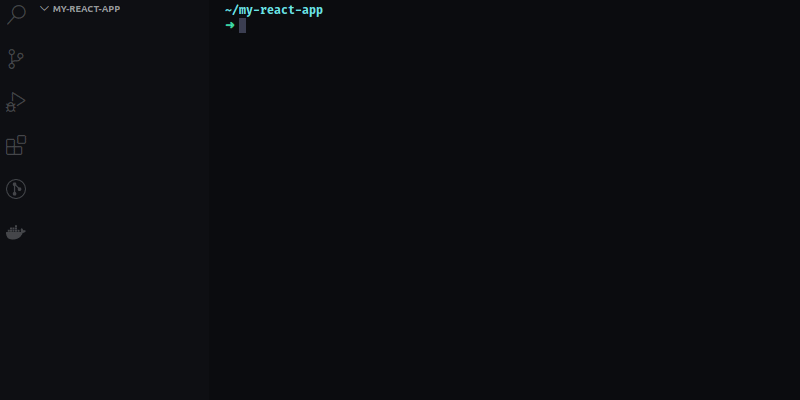

<h1 align="center">Welcome to awesome-react-generator 👋</h1>
<p>
  <a href="https://www.npmjs.com/package/awesome-react-generator" target="_blank">
    
  </a>
  <a href="https://github.com/iamtabrezkhan/awesome-react-generator#readme" target="_blank">
    
  </a>
  <a href="https://github.com/iamtabrezkhan/awesome-react-generator/graphs/commit-activity" target="_blank">
    
  </a>
  <a href="https://github.com/iamtabrezkhan/awesome-react-generator/blob/master/LICENSE" target="_blank">
    
  </a>
  <a href="https://twitter.com/TabrezX" target="_blank">
    
  </a>
</p>

> No more clicking around to create files in your react project! Awesome React Generator is Command Line Tool that let's you generate component files/folders without leaving your terminal.

<p align="center">
  
</p>

### 🏠 [Homepage](https://github.com/iamtabrezkhan/awesome-react-generator)

## Install

```sh
npm install awesome-react-generator -g
```

## Usage

```sh
rg component rfc hello-world
```

## Commands

Check out the commands [here](docs/CLI.md)

## Override CLI options
Let's say you don't want to pass `--test` option every time you want to generate a component with test file.
You can create a config file `.rgrc.js` at the root of your project to override CLI options.

Example below:
```js
/* this will generate test file with .spec.js extension and modular css file for every generated component */
module.exports = {
  component: {
    options: {
      test: true,
      cssType: "modular",
      testExt: "spec-js",
    },
  },
};
```
or

```js
/* this will generate test file with .spec.js extension and modular css file for every generated component but for rfc type component it will generate test file with extension .test.js and normal css file */
module.exports = {
  component: {
    rfc: {
      testExt: 'test-js',
      cssType: 'normal',
    },
    options: {
      test: true,
      cssType: "modular",
      testExt: "spec-js",
    },
  },
};
```

## Help

```sh
rg -h
```

## Run tests

```sh
npm run test
```

## Author

👤 **Tabrez Khan**

- Website: https://iamtabrezkhan.github.io
- Twitter: [@TabrezX](https://twitter.com/TabrezX)
- Github: [@iamtabrezkhan](https://github.com/iamtabrezkhan)
- LinkedIn: [@iamtabrezkhan](https://linkedin.com/in/iamtabrezkhan)

## 🤝 Contributing

Contributions, issues and feature requests are welcome!<br />Feel free to check [issues page](https://github.com/iamtabrezkhan/awesome-react-generator/issues). You can also take a look at the [contributing guide](https://github.com/iamtabrezkhan/awesome-react-generator/blob/master/CONTRIBUTING.md).

## Show your support

Give a ⭐️ if this project helped you!

## 📝 License

Copyright © 2020 [Tabrez Khan](https://github.com/iamtabrezkhan).<br />
This project is [MIT](https://github.com/iamtabrezkhan/awesome-react-generator/blob/master/LICENSE) licensed.

---

_This README was generated with ❤️ by [readme-md-generator](https://github.com/kefranabg/readme-md-generator)_
